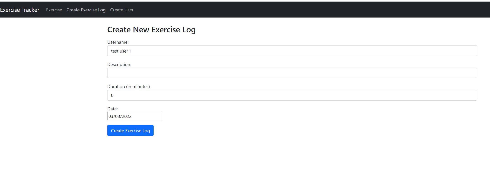

# Exercise-Tracker

## Table Of Contents:
- [Description](#Description)
- [Deployment](#Deployment)
- [Installation](#Installation)
- [Credits](#Credits)
- [License](#License)

## Description

The exercise tracker project was completed with intention of practicing my knowledge of HTML, Bootstrap, JavaScript along with the requirements for a backend MERN application which includes NodeJS, Express, and Mongo.db. Should you with to view the code, you may do so by accessing the links provided below.

## Deployment: 

GitHub Repo: https://github.com/al-moreno/exercise-tracker

GitHub Pages:  https://al-moreno.github.io/exercise-tracker/ 

## Installation:
1.  No installation if needed 
2.  You may view code through access of GitHub, link provided above.
3.  You may view site through GitHub Pages, link provided above. 

## Credits:
freeCodeCamp.org:  https://www.youtube.com/watch?v=7CqJlxBYj-M

## License
MIT License

Copyright (c) 

Permission is hereby granted, free of charge, to any person obtaining a copy of this software and associated documentation files (the "Software"), to deal in the Software without restriction, including without limitation the rights to use, copy, modify, merge, publish, distribute, sublicense, and/or sell copies of the Software, and to permit persons to whom the Software is furnished to do so, subject to the following conditions:

The above copyright notice and this permission notice shall be included in all copies or substantial portions of the Software.

THE SOFTWARE IS PROVIDED "AS IS", WITHOUT WARRANTY OF ANY KIND, EXPRESS OR IMPLIED, INCLUDING BUT NOT LIMITED TO THE WARRANTIES OF MERCHANTABILITY, FITNESS FOR A PARTICULAR PURPOSE AND NONINFRINGEMENT. IN NO EVENT SHALL THE AUTHORS OR COPYRIGHT HOLDERS BE LIABLE FOR ANY CLAIM, DAMAGES OR OTHER LIABILITY, WHETHER IN AN ACTION OF CONTRACT, TORT OR OTHERWISE, ARISING FROM, OUT OF OR IN CONNECTION WITH THE SOFTWARE OR THE USE OR OTHER DEALINGS IN THE SOFTWARE.
 